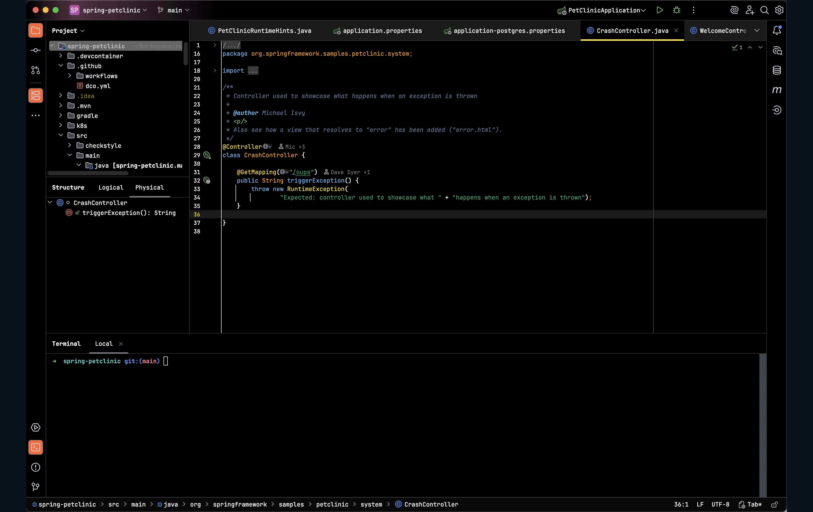

# codeSTACKr Theme for IntelliJ

[](https://plugins.jetbrains.com/plugin/29007-codestackr-theme)
[](https://plugins.jetbrains.com/plugin/29007-codestackr-theme)
[](https://plugins.jetbrains.com/plugin/29007-codestackr-theme)
[](https://github.com/ranjan-mohanty/codestackr-intellij-theme)
[](https://github.com/ranjan-mohanty/codestackr-intellij-theme/releases/latest)
[](https://github.com/ranjan-mohanty/codestackr-intellij-theme/releases/latest)
[](https://github.com/ranjan-mohanty/codestackr-intellij-theme/actions)
[](https://plugins.jetbrains.com/plugin/29007-codestackr-theme)
[](LICENSE)
[](https://github.com/ranjan-mohanty/codestackr-intellij-theme/issues)

A beautiful dark theme for IntelliJ IDEA and other JetBrains IDEs, based on the
popular
[codeSTACKr VS Code theme](https://github.com/codestackr/codestackr-vscode-theme).

## Features

- **Deep Dark Background**: Easy on the eyes with a carefully chosen dark
  background (#09131b)
- **Vibrant Syntax Highlighting**: Carefully selected colors for optimal code
  readability
- **Two Variants**: Choose between Regular and Muted color schemes
- **Wide Language Support**: Optimized for Java, Kotlin, JavaScript, TypeScript,
  Python, HTML, CSS, JSON, Markdown, SQL, and more
- **Consistent UI**: Matching UI colors throughout the IDE

## Screenshots



## Installation

### From JetBrains Marketplace (Recommended)

1. Open IntelliJ IDEA
2. Go to `Settings/Preferences` → `Plugins`
3. Search for "codeSTACKr Theme"
4. Click `Install`
5. Restart the IDE
6. Go to `Settings/Preferences` → `Appearance & Behavior` → `Appearance`
7. Select "codeSTACKr Theme" or "codeSTACKr Theme (Muted)" from the Theme
   dropdown

### Manual Installation

1. Download the latest release from the
   [releases page](https://github.com/ranjan-mohanty/codestackr-intellij-theme/releases)
2. Open IntelliJ IDEA
3. Go to `Settings/Preferences` → `Plugins`
4. Click the gear icon and select `Install Plugin from Disk...`
5. Select the downloaded `.zip` file
6. Restart the IDE
7. Go to `Settings/Preferences` → `Appearance & Behavior` → `Appearance`
8. Select your preferred theme variant

## Theme Variants

| Variant           | Description                                                                                                           |
| ----------------- | --------------------------------------------------------------------------------------------------------------------- |
| **Regular**       | The original vibrant color scheme with bold, saturated colors perfect for those who prefer high contrast.             |
| **Muted**         | A softer variant with more muted colors, ideal for extended coding sessions and reduced eye strain.                   |
| **Light**         | A light theme variant for daytime coding with carefully adjusted colors for optimal readability on white backgrounds. |
| **High Contrast** | A high contrast dark theme for better accessibility with maximum contrast between text and background.                |

## Building from Source

### Prerequisites

- JDK 21 or higher
- Gradle 9.2 or higher

### Build Steps

```bash
# Clone the repository
git clone https://github.com/ranjan-mohanty/codestackr-intellij-theme.git
cd codestackr-intellij-theme

# Build the plugin
./gradlew buildPlugin

# The plugin will be in build/distributions/
```

### Development

#### Quick Commands (using Make)

```bash
make help          # Show all available commands
make build         # Build the plugin
make test          # Run tests
make verify        # Verify plugin
make format        # Format markdown files
make run           # Run IntelliJ with plugin
make clean         # Clean build artifacts
```

#### Using Gradle Directly

```bash
./gradlew buildPlugin    # Build the plugin
./gradlew runIde         # Run IntelliJ IDEA with the plugin
./gradlew test           # Run tests
./gradlew verifyPlugin   # Verify plugin structure
./gradlew format         # Format markdown files
./gradlew clean          # Clean build artifacts
```

## Compatibility

- **IntelliJ IDEA 2019.1+** (tested across multiple versions from 2019.1 to latest)
- All JetBrains IDEs (PyCharm, WebStorm, PhpStorm, etc.)

The plugin is automatically tested for compatibility across multiple IDE versions
before each release to ensure it works correctly on both older and newer
versions of the platform.

## Publishing to JetBrains Marketplace

### Publishing Prerequisites

1. Create an account at [JetBrains Marketplace](https://plugins.jetbrains.com/)
2. Generate a permanent token from your
   [JetBrains Account](https://plugins.jetbrains.com/author/me/tokens)

### Publish Steps

```bash
# Set your marketplace token
export PUBLISH_TOKEN="your-token-here"

# Build and publish
./gradlew publishPlugin
```

The plugin will be submitted for review. Approval typically takes 1-3 business
days.

For detailed publishing instructions, see the
[IntelliJ Platform Plugin Publishing Guide](https://plugins.jetbrains.com/docs/intellij/publishing-plugin.html).

## Contributing

Contributions are welcome! Please feel free to submit a Pull Request.

1. Fork the repository
2. Create your feature branch (`git checkout -b feature/AmazingFeature`)
3. Commit your changes (`git commit -m 'Add some AmazingFeature'`)
4. Push to the branch (`git push origin feature/AmazingFeature`)
5. Open a Pull Request

## Credits

- Original VS Code theme by
  [Jesse Hall (codeSTACKr)](https://github.com/codestackr)
- IntelliJ port created with ❤️ for the developer community

## License

MIT License - see [LICENSE](LICENSE) file for details

## Support

- 🐛
  [Report a bug](https://github.com/ranjan-mohanty/codestackr-intellij-theme/issues)
- 💡
  [Request a feature](https://github.com/ranjan-mohanty/codestackr-intellij-theme/issues)
- ⭐ Star this repo if you like it!

## Links

- [VS Code Theme](https://github.com/codestackr/codestackr-vscode-theme)
- [codeSTACKr YouTube](https://youtube.com/codeSTACKr)
- [VS Code SuperHero Course](https://vsCodeHero.com)

---

**Never stop learning and Never give up!** 🚀
